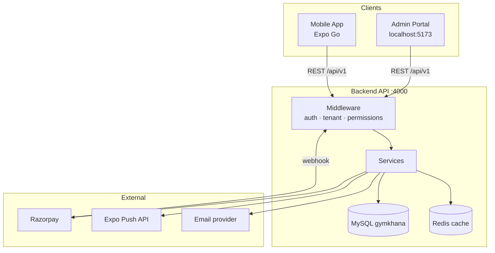
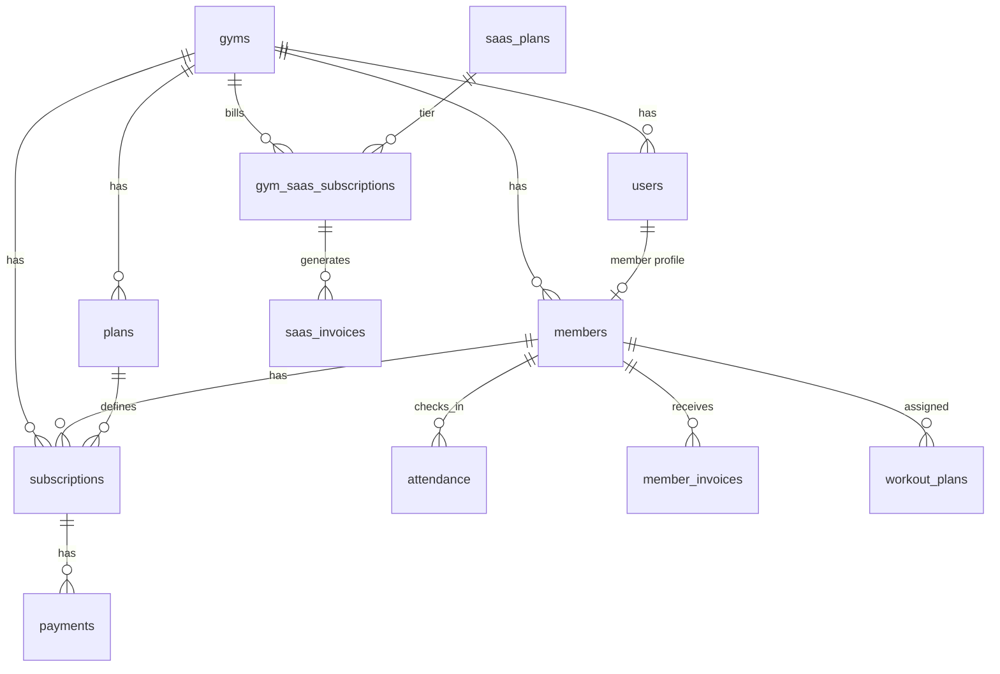

# GymKhana — System Architecture & Product Guide

**Last updated:** 2026-06-13

GymKhana is a **multi-tenant SaaS gym business platform**. Each gym is an isolated tenant sharing one deployment and database. The product spans three applications:

| App | Stack | Users |
|-----|-------|-------|
| **Backend API** | Node.js, Express, Sequelize, MySQL | All clients |
| **Admin Portal** | React, Vite, TypeScript, Tailwind, React Query | Gym staff (owner → receptionist) |
| **Mobile App** | Expo SDK 54, Expo Router, React Query | Gym members |

Related docs:
- [FEATURES.md](./FEATURES.md) — feature inventory
- [SAAS_ROADMAP.md](./SAAS_ROADMAP.md) — phased product roadmap
- [SYSTEM_GAPS_AND_ISSUES.md](./SYSTEM_GAPS_AND_ISSUES.md) — known gaps & fixes

---

## 1. High-level architecture



### Request lifecycle

1. Client sends `Authorization: Bearer <accessToken>` (except public routes).
2. **Auth middleware** verifies JWT → attaches `req.user` (`id`, `role`, `gymId`).
3. **Tenant middleware** (`requireTenant`) ensures `req.gymId` is set for tenant-scoped routes.
4. **Role / permission middleware** gates staff vs member actions.
5. **Platform access middleware** (`requirePlatformAccess`) blocks tenant API when gym SaaS trial/subscription is inactive.
6. **Joi validation** on params, query, body.
7. **Controller** → **Service** → **Sequelize models** → MySQL.
8. Response via standard envelope: `{ success, message?, data, meta? }`.

---

## 2. Repository structure

```
gymKhana/
├── backend/           # Express API + Sequelize + migrations
│   └── src/
│       ├── api/       # routes, controllers, validators, middlewares
│       ├── config/    # env, database, sequelize
│       ├── constants/ # roles, permissions
│       ├── db/        # migrations, seeders
│       ├── models/    # Sequelize models
│       ├── services/  # business logic
│       └── utils/     # helpers (JWT, pagination, subscriptionActive)
├── admin-portal/      # React staff dashboard
│   └── src/
│       ├── app/       # layouts, routing
│       ├── features/  # API clients per domain
│       └── pages/     # screen components
├── mobile-app/        # Expo member app
│   ├── app/           # Expo Router screens
│   ├── context/       # AuthContext
│   └── lib/           # api, queries, push, subscriptions
└── docs/              # product & technical documentation
```

---

## 3. Multi-tenant model

### Tenant root: `gyms`

Every gym is a row in `gyms`. Tenant-scoped tables carry `gym_id`:

- `users`, `members`, `plans`, `subscriptions`, `payments`, `attendance`
- `trainers`, `workout_plans`, `announcements`, `member_invoices`, `push_tokens`
- `gym_saas_subscriptions`, `saas_invoices` (platform billing per gym)

### Isolation rules

- JWT for staff includes `gymId` from `users.gym_id`.
- `requireTenant` sets `req.gymId`; services **must** filter by `gymId` on reads/writes.
- Cross-tenant access returns `403 Forbidden`.
- Members are scoped to their own `memberId` on member-only endpoints.

### Onboarding a new gym

`POST /gyms/onboard` (public):

1. Creates `gyms` row + owner `users` row.
2. Seeds default member plans (Monthly / Quarterly / Yearly).
3. Starts SaaS trial subscription (`gym_saas_subscriptions`).
4. Returns owner JWT tokens.

---

## 4. Authentication & authorization

### JWT tokens

| Token | TTL | Payload |
|-------|-----|---------|
| Access | ~15 min | `sub`, `role`, `gymId` |
| Refresh | ~7 days | `sub`, `type: refresh` |

Refresh flow: `POST /auth/refresh` with `refreshToken` → new access + refresh pair.

### Roles

| Role | Typical use |
|------|-------------|
| `owner` | Full gym control + billing |
| `admin` | Full gym operations |
| `manager` | Operations, limited billing |
| `receptionist` | Front desk (members, attendance, payments) |
| `trainer` | Members, workout plans, assignments |
| `member` | Mobile app only |

### Permissions

Fine-grained permissions in `constants/permissions.js` (e.g. `members.write`, `payments.write`). `requirePermission('…')` middleware checks role → permission map.

### Admin portal nav

Sidebar items are filtered by role in `AppLayout.tsx` (e.g. Billing: owner/admin only).

---

## 5. Database schema (core entities)



### Key tables

| Table | Purpose |
|-------|---------|
| `users` | Login accounts (all roles) |
| `members` | Member profile linked to `users` (role=member) |
| `plans` | Gym membership plans (duration, price) |
| `subscriptions` | Member ↔ plan assignment (`active` / `expired` / `cancelled`) |
| `payments` | Payment records (idempotent via `idempotency_key`) |
| `attendance` | Check-in / check-out with `source` (manual, qr, biometric) |
| `announcements` | Gym → member messages |
| `trainers` | Trainer profiles |
| `workout_plans` | Trainer-assigned workout programs |
| `member_invoices` | GST PDF invoices for member payments |
| `saas_plans` | Platform tiers (Basic / Pro / Enterprise) |
| `gym_saas_subscriptions` | Gym's subscription to GymKhana platform |
| `saas_invoices` | Platform billing invoices |
| `push_tokens` | Expo push tokens per user/device |

### Subscription status semantics

| Status | Meaning |
|--------|---------|
| `active` | Valid membership; `ends_at` not passed |
| `expired` | Period ended (cron or manual) |
| `cancelled` | Staff cancelled; member may subscribe again |

**Active check:** `status === 'active'` **and** `ends_at >= today`. Cancelled/expired subscriptions do **not** block new purchases.

---

## 6. Backend API surface

Base URL: `http://<host>:4000/api/v1`

### Auth
| Method | Path | Description |
|--------|------|-------------|
| POST | `/auth/register` | Member signup |
| POST | `/auth/login` | Login |
| POST | `/auth/refresh` | Refresh tokens |
| GET | `/auth/me` | Current user (+ `memberId` for members) |
| POST | `/auth/change-password` | Change password |
| POST | `/auth/forgot-password` | Request reset |
| POST | `/auth/reset-password` | Reset with token |

### Gym operations (tenant)
| Domain | Key endpoints |
|--------|---------------|
| Members | `GET/POST/PATCH /members`, activate/deactivate |
| Plans | CRUD + `/plans/catalog` (mobile) |
| Subscriptions | `GET /subscriptions`, `POST /subscriptions` (staff assign), `POST /subscriptions/self` (member buy), `POST /:id/cancel`, `POST /:id/renew` |
| Attendance | `GET /attendance`, `POST /check-in`, `POST /check-out`, `POST /verify-pass` |
| Payments | `GET/POST /payments` (idempotent) |
| Stats | `/stats/kpis`, `/stats/revenue-trend`, `/stats/attendance-heatmap`, `/stats/mrr` |
| Announcements | Staff CRUD + `GET /announcements/inbox` (mobile) |
| Engagement | `GET /engagement/me` (streak, visits) |
| Trainers | `GET/POST /trainers`, member assignment |
| Workout plans | CRUD, auto-scoped for members |
| Member invoices | `GET /member-invoices`, `GET /:id/pdf` |
| Push | `POST /push/register` |

### Platform / SaaS
| Method | Path | Description |
|--------|------|-------------|
| POST | `/gyms/onboard` | New gym signup |
| GET/PATCH | `/gyms/me` | Gym profile + GST |
| GET | `/saas/plans` | Platform tiers |
| GET/POST | `/saas/subscription/*` | Gym platform subscription |
| GET/POST | `/saas/invoices/*` | Platform invoices |
| POST | `/saas/invoices/:id/razorpay-order` | Razorpay checkout |
| POST | `/webhooks/razorpay` | Payment webhook |

---

## 7. Admin portal architecture

### Stack
- **Vite** dev server (`localhost:5173`)
- **React Router** for routes
- **TanStack Query** for server state
- **Axios** with interceptors (auth refresh)
- **Tailwind CSS** + shadcn-style UI components
- **Recharts** for analytics

### Screen map

| Route | Screen | Roles |
|-------|--------|-------|
| `/` | Dashboard (KPIs) | Staff |
| `/members` | Member CRUD | Staff |
| `/plans` | Plan CRUD | owner, admin, manager |
| `/subscriptions` | Assign / renew / cancel | Staff |
| `/attendance` | Log + staff pass verify | Staff |
| `/payments` | Record payments | Staff |
| `/invoices` | GST invoice PDFs | owner, admin, manager |
| `/announcements` | Publish messages | Staff |
| `/analytics` | Revenue, heatmap, MRR | Staff |
| `/billing` | Platform SaaS billing | owner, admin |
| `/trainers` | Trainer management | Staff |
| `/workout-plans` | Workout programs | Staff |
| `/settings` | Profile, gym GST, password | Staff |
| `/onboard` | New gym signup | Public |

### Data flow example: record payment

1. Staff opens Payments → Record payment modal.
2. `POST /payments` with `Idempotency-Key` header.
3. Backend creates payment, may extend subscription end date.
4. **Member invoice** auto-generated (GST PDF).
5. React Query invalidates payments + invoices queries.

---

## 8. Mobile app architecture

### Stack
- **Expo SDK 54** + **Expo Router** (file-based tabs)
- **React Query** with **SecureStore** persistence
- **expo-notifications** for push
- **react-native-qrcode-svg** for entry pass QR

### Tab screens

| Tab | Purpose |
|-----|---------|
| Home | Plan status, engagement, quick check-in, QR scan |
| Plans | Browse catalog, self-subscribe |
| Attendance | Check-in history |
| Payments | Payment history |
| Workouts | Assigned workout plans |
| Messages | Announcements inbox |
| Profile | Account, password, logout |
| Pass | Visual QR + pass code for staff verify |

### Caching strategy

- React Query persists most queries to SecureStore (24h).
- **Subscriptions are NOT persisted** — they refetch on mount and when Plans tab gains focus (admin changes like cancel must reflect immediately).
- Auth tokens live in SecureStore separately (`AuthContext`).

### Member subscribe flow

1. Member opens Plans tab → fresh `GET /subscriptions`.
2. `isSubscriptionActive()` checks for genuinely active sub.
3. If none → Subscribe button enabled → `POST /subscriptions/self`.
4. Backend rejects only if an **active** (not cancelled/expired) subscription exists.

---

## 9. Cross-cutting features

### SaaS platform billing (gym → GymKhana)

- Plans: Basic / Pro / Enterprise with member & trainer limits.
- Trial → active → past_due → cancelled lifecycle.
- `requirePlatformAccess` soft-locks member/trainer routes when unpaid.
- Razorpay for online platform invoice payment; webhook marks paid.

### Member GST invoices

- Auto-created on `POST /payments`.
- Sequential invoice numbers per gym (`member_invoice_prefix` + seq).
- PDF via `pdfkit`; admin downloads from `/invoices`.

### Push notifications

- Mobile registers Expo token on login → `POST /push/register`.
- Backend sends via Expo Push API on:
  - New published announcement
  - Subscription expiring in 3 days (reminder job)

### Entry pass & staff verify

- Mobile pass encodes: `gymkhana:member:<uuid>` as QR + text.
- Admin Attendance → **Staff verify pass** → `POST /attendance/verify-pass`.
- Validates membership + optional check-in.

### Analytics / MRR

- `GET /stats/mrr`: MRR, ARR, active subs, renewal rate, payments MTD.
- Admin Analytics page shows KPI cards + charts.

---

## 10. Background jobs & integrations

| Job / integration | Trigger | Action |
|-------------------|---------|--------|
| Subscription expiry | Scheduled / manual | `expireDueSubscriptions()` → `expired` |
| Expiry reminders | Scheduled | Email + push for subs ending in 3 days |
| Razorpay webhook | HTTP POST | Mark SaaS invoice paid |
| Redis cache | Stats endpoints | Short TTL cache for KPIs/MRR |

### Environment variables (key)

**Backend (`backend/.env`)**
```
DATABASE_URL / DB_* 
JWT_SECRET, JWT_REFRESH_SECRET
CORS_ORIGINS
REDIS_URL (optional)
RAZORPAY_KEY_ID, RAZORPAY_KEY_SECRET, RAZORPAY_WEBHOOK_SECRET
```

**Admin (`admin-portal/.env`)**
```
VITE_API_URL=http://localhost:4000/api/v1
```

**Mobile (`mobile-app/.env`)**
```
EXPO_PUBLIC_API_URL=http://<LAN-IP>:4000/api/v1
```

---

## 11. Local development

```bash
# Terminal 1 — API
cd backend && npm run dev          # :4000

# Terminal 2 — Admin
cd admin-portal && npm run dev     # :5173

# Terminal 3 — Mobile (physical device)
cd mobile-app && npx expo start -c
# Update EXPO_PUBLIC_API_URL with PC LAN IP from ipconfig
```

| Task | Command |
|------|---------|
| DB migrate | `cd backend && npm run db:migrate` |
| DB seed | `cd backend && npm run db:seed` |
| Tests | `cd backend && npm test` |
| Default admin | `admin@gymkhana.local` / `Admin@12345` |

**After tenant/auth migrations:** staff and members must **logout and re-login** so JWT includes `gymId`.

---

## 12. Security model

- Passwords: bcrypt hashed.
- JWT signed with server secret; refresh rotation on use.
- Rate limiting per user/IP.
- Helmet security headers.
- Tenant isolation on every business query.
- Webhook signature verification (Razorpay HMAC).
- Idempotent payment creation prevents duplicate charges.
- Role + permission checks on destructive operations.

---

## 13. Known limitations & future work

| Area | Status |
|------|--------|
| Member payment gateway (UPI/card on subscribe) | Not started |
| CRM / leads pipeline | Phase D |
| Dedicated staff scanner app | Admin web verify works |
| Full retention rule engine | Basic reminders only |
| Two-gym automated isolation tests | Manual QA |
| `requirePlatformAccess` on all tenant routes | Partial |

See [SYSTEM_GAPS_AND_ISSUES.md](./SYSTEM_GAPS_AND_ISSUES.md) for incident log and detailed gaps.

---

## 14. Troubleshooting

### "You already have an active subscription" after admin cancel

**Cause:** Mobile cached old subscription data (status `active`) in React Query persistence.

**Fix (shipped):** Subscriptions no longer persisted; refetch on mount + Plans tab focus; `isSubscriptionActive()` respects `cancelled`/`expired`.

**User action:** Restart Expo (`npx expo start -c`), open Plans tab — Subscribe should be enabled.

### Admin 403 "Missing tenant context"

Re-login after migration so JWT includes `gymId`.

### Mobile "Network request failed"

Update `EXPO_PUBLIC_API_URL` in `mobile-app/.env` with current LAN IP; restart Expo with `-c`.

---

## 15. Gym Operating System features (2026-06-13)

### Fixed gym QR attendance (replaces member-QR-first flow)

| Step | Who | Action |
|------|-----|--------|
| Setup | Owner/Admin | **QR Setup** → print zone QR codes |
| Check-in | Member | Home → **QR check-in** → scan `gymkhana:gym:<gymId>:<zoneId>:<sig>` |
| Validate | Backend | HMAC signature, gym match, active membership, not frozen, not already checked in |

**API:** `GET /attendance-zones/qr-setup`, `POST /attendance/scan-gym-qr`

### Multiple QR zones + zone analytics

- Zones: Main Entrance (auto), Cardio, Weights, Pool, etc.
- Attendance rows store `zone_id`
- **API:** `GET /stats/zone-attendance?days=30`

### Attendance provider interface (future hardware)

```
QrAttendanceProvider      ✅ implemented
ManualAttendanceProvider  ✅ implemented
BiometricAttendanceProvider  stub
RfidAttendanceProvider       stub
```

Location: `backend/src/services/attendance/providers/`

### Leads CRM

Pipeline: `created → trial_scheduled → trial_completed → converted | lost`

**API:** `GET/POST/PATCH /leads`, `POST /leads/:id/start-trial`, `POST /leads/:id/convert`  
**Admin:** `/leads`

### Trial memberships

- Plans: 1 / 3 / 7 day trials (`is_trial`, `trial_days`, `trial_visits_limit`)
- Subscription tracks `trial_visits_used`
- Mobile home shows trial status + visits remaining

### Membership freeze

- `subscription_freezes` table; expiry extended when freeze completes
- Frozen members cannot check in
- **API:** `POST /freezes`, `GET /freezes`
- **Admin:** Subscriptions → **Freeze** button

### Family memberships

- `family_groups` + `family_members` (parent/child/spouse)
- **API:** `GET/POST /family-groups`

### Staff shift management

- **API:** `GET/POST /staff-shifts`, `DELETE /staff-shifts/:id`

### Retention automation engine

Rule types: `no_attendance_days`, `subscription_expiring_days`, `trial_ending_days`  
Actions: `push`, `email`, `notify_staff`  
**API:** `GET/POST/PATCH/DELETE /retention-rules`, `POST /retention-rules/run`  
**Admin:** `/retention`

### White labeling

Gym fields: `logo_url`, `brand_primary_color`, `brand_secondary_color`, `custom_domain`  
**Admin:** Settings → White label branding

---

## 16. Document index

| Document | Contents |
|----------|----------|
| **ARCHITECTURE.md** (this file) | System design, data model, flows |
| [FEATURES.md](./FEATURES.md) | Complete feature checklist |
| [SAAS_ROADMAP.md](./SAAS_ROADMAP.md) | Phase A–D roadmap |
| [SYSTEM_GAPS_AND_ISSUES.md](./SYSTEM_GAPS_AND_ISSUES.md) | Gaps, bugs, fixes |
| [API.md](./API.md) | API reference (if present) |
