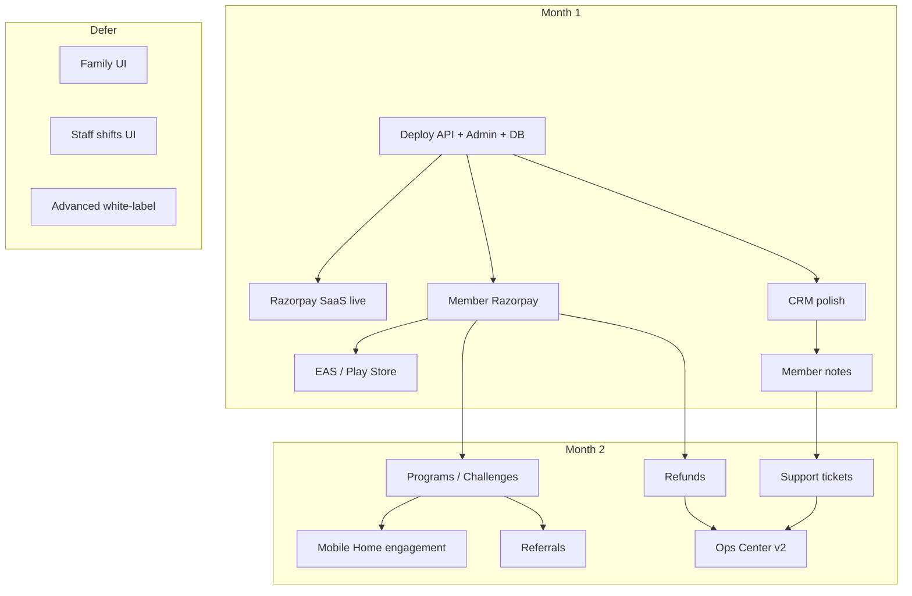

# GymKhana — 60-Day Implementation Roadmap

**Last updated:** 2026-06-20  
**Audience:** Founders, product, engineers  
**Related:** [PRODUCTION_READINESS.md](./PRODUCTION_READINESS.md) · [ARCHITECTURE.md](./ARCHITECTURE.md) · [FEATURES.md](./FEATURES.md) · [SAAS_ROADMAP.md](./SAAS_ROADMAP.md)

This document merges CTO/investor review with the current codebase state into one **actionable build plan**. Goal: **get real gyms to pay**, not accumulate impressive half-built features.

---

## 1. Strategic frame

### ✅ Already excellent (keep, don't rewrite)

| Area | Why it matters |
|------|----------------|
| **Gym business platform** (not attendance-only) | CRM, retention, billing, trainers, SaaS, mobile — correct product category |
| **Multi-tenancy first** | `gymId` on models, JWT tenant, onboarding — avoids painful rewrite later |
| **Mobile-first member UX** | Pass, QR, plans, payments (partial), workouts, messaging direction |
| **Operations Center admin** | Dashboard, member workspace, command palette, grouped nav — recent UX win |
| **SaaS billing ~80%** | Razorpay order + webhook for platform invoices |

### ⚠️ Overbuilt for current stage (defer until first paying gyms)

| Feature | Current state | Action |
|---------|---------------|--------|
| Family memberships | API exists, no admin UI | **Defer** — <5% gyms need at launch |
| Staff shift management | API exists, no admin UI | **Defer** — not revenue-driving |
| Advanced white-label (custom domains, full brand kit) | DB fields exist | **Defer** — enterprise, not launch |
| Complex automation (Zapier-for-gyms) | Basic retention rules API | **Keep simple IF/THEN only** |
| Hardware integrations (biometric/RFID) | Stubs only | **Defer** |

### ❌ Missing (build before advanced features)

| Priority | Feature | Current state |
|----------|---------|---------------|
| P0 | Production deployment | Not deployed |
| P0 | Member Razorpay payments | Subscriptions created without payment |
| P0 | Play Store / EAS build | No `eas.json` |
| P1 | Member notes (staff timeline) | `members.notes` single field; workspace Notes tab is placeholder |
| P1 | Internal staff notes (leads/CRM) | `leads.notes` single text only |
| P1 | Support / tickets (member app) | Not built |
| P1 | Refunds & adjustments | `Payment.status = refunded` enum only; no API |
| P1 | Referral system | Not built |
| **P1 ★** | **Programs / Challenges** | Not built — highest engagement ROI |
| P1 | Mobile home = fitness companion | Home is mostly pass + quick actions |

---

## 2. 60-day calendar

### Month 1 — Revenue + launch foundation

**Week 1–2: Wave 1 — Infrastructure**

| Day | Task | Owner | Done when |
|-----|------|-------|-----------|
| 1–2 | Pick host (Railway/Render/VPS) + managed MySQL | DevOps | API reachable on HTTPS |
| 2–3 | Production env: JWT, DB, CORS, secrets | Backend | Health check 200 on prod URL |
| 3–4 | Deploy admin (`vite build` → Vercel/Netlify) | Frontend | Login works against prod API |
| 4–5 | DB migrate + backup cron + smoke test | Backend | 2 test gyms, members, attendance |
| 5–7 | Email provider (Resend/SendGrid) replace console | Backend | Receipt/expiry email sends |

**Week 2–3: Wave 2 — Platform monetization (GymKhana gets paid)**

| Day | Task | Done when |
|-----|------|-----------|
| 8–9 | Razorpay live keys + webhook URL registered | Dashboard shows captured events |
| 9–10 | End-to-end SaaS invoice payment on prod | Trial → invoice → pay → `active` |
| 10–11 | `requirePlatformAccess` on all tenant routes | Expired SaaS blocks member CRUD |
| 11–12 | Retention rule cron (daily job, not manual) | Rules fire without admin click |

**Week 3–4: Wave 3 — Member payments + CRM polish**

| Day | Task | Done when |
|-----|------|-----------|
| 15–18 | Member Razorpay backend (§4.1) | Order → webhook → subscription + payment + GST PDF |
| 18–20 | Mobile Razorpay on Plans (EAS dev build) | Real device pay → pass active |
| 20–21 | Gate `POST /subscriptions/self` (paid only) | Free self-subscribe blocked in prod |
| 21–23 | CRM improvements (§4.2) | Lead pipeline, follow-up dates, convert to member |
| 23–25 | Member notes v1 (§4.3) | Staff add/view notes on member workspace |
| 25–28 | EAS production build + Play Store internal track | APK/AAB installable outside Expo Go |

### Month 2 — Engagement + operations

**Week 5–6: Programs & challenges (§4.6) ★**

| Day | Task | Done when |
|-----|------|-----------|
| 29–32 | Backend: programs, enrollments, leaderboard | Admin CRUD + member join API |
| 32–35 | Admin: Programs page + enrollment mgmt | Gym creates "90 Day Fat Loss" |
| 35–37 | Mobile: challenge card on Home + progress screen | Member sees rank, days left, check-ins |

**Week 6–7: Support, refunds, referrals**

| Day | Task | Done when |
|-----|------|-----------|
| 38–40 | Support tickets (§4.5) | Member submits freeze/issue; staff replies |
| 40–42 | Refunds & adjustments (§4.4) | Admin refund payment; transfer subscription |
| 42–44 | Referral system (§4.7) | Invite link → friend joins → reward applied |
| 44–45 | Staff notes on leads (§4.3b) | Timeline notes on LeadsPage |

**Week 7–8: Mobile engagement redesign + ops polish**

| Day | Task | Done when |
|-----|------|-----------|
| 46–48 | Home redesign (§4.8) | Today's workout, streak, challenge, trainer message |
| 48–50 | Operations Center v2 | At-risk members, renewals due, ticket queue widget |
| 50–52 | Sentry + uptime monitor | Errors visible in prod |
| 52–56 | QA: 2-gym tenant isolation + payment regression | Checklist in PRODUCTION_READINESS §8 green |
| 56–60 | Store listing polish, privacy/terms, pilot onboarding | First pilot gym live |

### After first paying gyms (Month 3+)

- Family memberships admin UI
- Staff shifts admin UI
- Per-gym Razorpay keys or Razorpay Route
- Custom domain white-label
- WhatsApp notifications
- Dedicated staff scanner app

---

## 3. Workstreams & dependencies



**Hard rule:** Do not start Programs until member payments work — challenges tied to paid/active members.

---

## 4. Feature specifications

### 4.1 Member payment gateway (P0)

**Problem:** `POST /subscriptions/self` creates subscription without money. Mobile Plans is a demo, not a product.

**Reference:** [PRODUCTION_READINESS.md §5.2](./PRODUCTION_READINESS.md#52-flow-b--member-billing-member-pays-gym--not-implemented)

#### Backend

**Migration** `YYYYMMDDHHMMSS-add-razorpay-member-payment-fields.js`:

```sql
ALTER TABLE payments
  ADD COLUMN razorpay_order_id VARCHAR(64) NULL,
  ADD COLUMN razorpay_payment_id VARCHAR(64) NULL,
  ADD UNIQUE INDEX payments_razorpay_payment_id (razorpay_payment_id);

CREATE TABLE payment_intents (
  id CHAR(36) PRIMARY KEY,
  gym_id CHAR(36) NOT NULL,
  member_id CHAR(36) NOT NULL,
  plan_id CHAR(36) NOT NULL,
  subscription_id CHAR(36) NULL,
  amount_cents INT NOT NULL,
  currency VARCHAR(10) NOT NULL DEFAULT 'INR',
  razorpay_order_id VARCHAR(64) NOT NULL,
  status ENUM('created','captured','failed','expired') NOT NULL DEFAULT 'created',
  created_at DATETIME NOT NULL,
  updated_at DATETIME NOT NULL,
  INDEX (gym_id, member_id),
  UNIQUE (razorpay_order_id)
);
```

**Endpoints:**

| Method | Path | Auth | Body |
|--------|------|------|------|
| `POST` | `/payments/member/create-order` | member | `{ planId }` |
| `POST` | `/payments/member/verify` | member | `{ razorpayOrderId, razorpayPaymentId, signature }` (optional fast-path) |

**`create-order` logic:**

1. Resolve member from JWT + `requireTenant`
2. Load `Plan` by `planId`; validate `priceCents > 0`, plan belongs to gym
3. Create Razorpay order (amount from server, never client)
4. Insert `payment_intents` row
5. Return `{ orderId, amount, currency, keyId }`

**Webhook extension** (`razorpay.service.js`):

```
payment.captured
  if notes.type === 'member_subscription':
    find payment_intent by order_id
    if payment exists for razorpay_payment_id → return 200 (idempotent)
    BEGIN TRANSACTION
      create Payment (paid)
      create or renew Subscription
      createInvoiceForPayment (GST PDF)
      mark intent captured
    COMMIT
    sendPaymentReceipt email
```

**Prod gate:** In `NODE_ENV=production`, reject `POST /subscriptions/self` unless linked captured payment intent.

#### Mobile (`mobile-app/app/(tabs)/plans.tsx`)

1. Install `react-native-razorpay` (requires EAS — not Expo Go)
2. On plan tap → `create-order` → open Razorpay checkout
3. On success → poll subscription or call verify → navigate to Pass tab
4. Show "Renew" CTA on Home when `daysLeft <= 7`

#### Admin

- Payments list shows `method: razorpay` + gateway ref
- Member workspace timeline includes online payments
- Keep manual **Record payment** for cash/UPI at desk

#### v1 money routing

Use **platform Razorpay account** (single webhook). Document manual payout to pilot gyms. Plan per-gym keys (Model B) before 10+ gyms.

**Acceptance criteria:**

- [ ] Member pays ₹X on real Android device → subscription active within 30s
- [ ] Duplicate webhook does not double-charge
- [ ] GST PDF generated and downloadable in admin
- [ ] Failed payment does not activate subscription

---

### 4.2 CRM / leads improvements (P1, Month 1)

**Current:** `LeadsPage` + `Lead` model with single `notes` text, status, source.

#### Enhancements (no new tables required for v1)

| Item | Implementation |
|------|----------------|
| Pipeline columns | Kanban or status filters: `new` → `contacted` → `trial` → `won` / `lost` |
| Follow-up date | Add `followUpAt DATE` + `followUpNote` on `leads` |
| Quick actions | Call / WhatsApp deep link from phone field |
| Convert to member | Existing flow — add "Create trial subscription" shortcut |
| Lead source analytics | Dashboard widget: leads by source this month |

#### Migration

```sql
ALTER TABLE leads
  ADD COLUMN follow_up_at DATE NULL,
  ADD COLUMN follow_up_note VARCHAR(500) NULL;
```

#### Admin UI (`LeadsPage.tsx`)

- Follow-up badge when `followUpAt <= today`
- Sort by follow-up date
- Bulk export CSV (optional week 4)

**Acceptance criteria:**

- [ ] Receptionist sees today's follow-ups on Dashboard
- [ ] Lead → member conversion creates user + member in one flow

---

### 4.3 Member notes & staff notes (P1)

**Problem:** `members.notes` is one blob; workspace Notes tab is empty placeholder. Gyms need timestamped, attributed notes.

#### 4.3a Member notes (new table — preferred over expanding single field)

**Model:** `member_notes`

| Column | Type | Notes |
|--------|------|-------|
| `id` | UUID | PK |
| `gym_id` | UUID | tenant |
| `member_id` | UUID | FK |
| `author_user_id` | UUID | staff who wrote |
| `body` | TEXT | "Has knee injury", "Prefers evening batch" |
| `visibility` | ENUM | `internal` (default), `trainer_only` (optional v2) |
| `pinned` | BOOLEAN | Show at top of workspace |
| `created_at` | DATETIME | |

**Endpoints:**

| Method | Path | Auth |
|--------|------|------|
| `GET` | `/members/:id/notes` | staff |
| `POST` | `/members/:id/notes` | staff |
| `PATCH` | `/members/:id/notes/:noteId` | staff (author or admin) |
| `DELETE` | `/members/:id/notes/:noteId` | admin |

**Admin UI:** Replace Notes tab placeholder in `MemberWorkspacePage.tsx`:

- Textarea + Save
- List newest-first with author name + relative time
- Pin toggle
- Migrate existing `members.notes` → one `member_notes` row on first load (one-time script)

#### 4.3b Staff notes on leads

Same pattern: `lead_notes` table OR reuse generic `staff_notes` polymorphic (`entityType`, `entityId`).

**Recommendation:** Generic `staff_notes` for member + lead + subscription (future).

```sql
CREATE TABLE staff_notes (
  id CHAR(36) PRIMARY KEY,
  gym_id CHAR(36) NOT NULL,
  entity_type ENUM('member','lead','subscription') NOT NULL,
  entity_id CHAR(36) NOT NULL,
  author_user_id CHAR(36) NOT NULL,
  body TEXT NOT NULL,
  pinned BOOLEAN DEFAULT FALSE,
  created_at DATETIME NOT NULL,
  updated_at DATETIME NOT NULL,
  INDEX (gym_id, entity_type, entity_id)
);
```

**Acceptance criteria:**

- [ ] Trainer adds "ACL recovery — no squats" → visible on member workspace
- [ ] Lead note "Call Tuesday re annual plan" → visible on Leads detail

---

### 4.4 Refunds & adjustments (P1)

**Problem:** Real gyms mis-record payments, issue refunds, transfer memberships. `REFUNDED` status exists but no workflow.

#### Refund payment

**Endpoint:** `POST /payments/:id/refund`

| Field | Rule |
|-------|------|
| `reason` | Required text |
| `amountCents` | Optional partial; default full payment amount |
| `method` | `cash`, `upi`, `razorpay` (triggers Razorpay refund API if gateway ref exists) |

**Logic:**

1. Validate payment belongs to gym, status `paid`
2. If Razorpay: call `razorpay.payments.refund(paymentId)`
3. Set payment `status = refunded`, append reason to `notes`
4. Audit log entry
5. **Do not** auto-cancel subscription (admin chooses separately)

#### Adjustments (new endpoints)

| Action | Endpoint | Behavior |
|--------|----------|----------|
| Extend subscription | `POST /subscriptions/:id/extend` | `{ days, reason }` — shifts `endsAt` |
| Transfer plan | `POST /subscriptions/:id/change-plan` | `{ planId, reason }` — proration manual in v1 |
| Transfer member | `POST /subscriptions/:id/transfer` | `{ toMemberId, reason }` — rare but requested |
| Void wrong payment | `POST /payments/:id/void` | Mark failed + create correcting payment row |

#### Admin UI

- Payment detail drawer: **Refund** button
- Member workspace Subscriptions tab: **Extend** / **Change plan**
- Timeline shows adjustments with reason

**Acceptance criteria:**

- [ ] Full refund marks payment refunded; subscription unchanged unless admin acts
- [ ] Razorpay refund creates matching record
- [ ] All actions in audit log

---

### 4.5 Support / ticket system (P1)

**Problem:** Members need in-app way to report issues, request freeze, ask questions — not WhatsApp chaos.

#### Model: `support_tickets`

| Column | Type |
|--------|------|
| `id` | UUID |
| `gym_id` | UUID |
| `member_id` | UUID |
| `category` | ENUM: `general`, `billing`, `freeze`, `facility`, `trainer` |
| `subject` | VARCHAR(200) |
| `status` | ENUM: `open`, `in_progress`, `resolved`, `closed` |
| `priority` | ENUM: `low`, `normal`, `high` |
| `assigned_to_user_id` | UUID nullable |
| `created_at` | DATETIME |

#### Model: `support_messages`

| Column | Type |
|--------|------|
| `id` | UUID |
| `ticket_id` | UUID |
| `author_user_id` | UUID (member's user or staff) |
| `body` | TEXT |
| `is_staff` | BOOLEAN |
| `created_at` | DATETIME |

**Endpoints:**

| Method | Path | Auth |
|--------|------|------|
| `GET` | `/support/tickets` | member (own) / staff (all gym) |
| `POST` | `/support/tickets` | member |
| `GET` | `/support/tickets/:id` | member (own) / staff |
| `POST` | `/support/tickets/:id/messages` | member + staff |
| `PATCH` | `/support/tickets/:id` | staff (status, assignee) |

**Integrations:**

- Reuse existing **freeze request** flow OR route freeze category to existing freeze API + link ticket
- Push notification to staff on new ticket
- Email member on staff reply (optional v1.1)

#### Mobile

- **You** tab → **Help & Support**
- List tickets + new ticket form (category picker)
- Thread view (chat-style)

#### Admin

- **Support** nav item under Operations (badge = open count)
- Ops Center widget: open tickets, avg response time

**Acceptance criteria:**

- [ ] Member submits freeze request → staff sees ticket + can resolve
- [ ] Member gets push when staff replies

---

### 4.6 Programs / challenges (P1 ★ — highest engagement ROI)

**Problem:** App is "membership wallet". Programs create retention, community, upsells.

#### Domain model

**`programs`**

| Column | Type | Example |
|--------|------|---------|
| `id` | UUID | |
| `gym_id` | UUID | |
| `title` | VARCHAR | "90 Day Fat Loss Challenge" |
| `description` | TEXT | |
| `type` | ENUM | `challenge`, `program`, `event` |
| `starts_at` | DATE | |
| `ends_at` | DATE | |
| `max_participants` | INT nullable | 100 |
| `is_public` | BOOLEAN | Show in app browse |
| `cover_image_url` | VARCHAR nullable | |
| `rules_json` | JSON | See below |
| `status` | ENUM | `draft`, `published`, `archived` |

**`rules_json` schema (v1):**

```json
{
  "scoring": "attendance_count",
  "minCheckInsPerWeek": 3,
  "weighInEnabled": false,
  "prizeDescription": "Top 3 get free month"
}
```

**`program_enrollments`**

| Column | Type |
|--------|------|
| `id` | UUID |
| `program_id` | UUID |
| `member_id` | UUID |
| `joined_at` | DATETIME |
| `status` | `active`, `completed`, `dropped` |
| `score` | INT default 0 |
| `progress_json` | JSON `{ checkIns: 12, lastCheckInAt: "..." }` |

#### Scoring v1 (simple, shippable)

- **Primary metric:** attendance count during program window
- On each check-in: if member enrolled in active program → increment `score`
- Nightly job: recalculate ranks

**`program_leaderboard`** (materialized view or query):

```sql
SELECT member_id, score, RANK() OVER (ORDER BY score DESC) AS rank
FROM program_enrollments
WHERE program_id = ? AND status = 'active'
```

#### Endpoints

| Method | Path | Auth |
|--------|------|------|
| `GET` | `/programs` | staff (all) / member (published) |
| `POST` | `/programs` | staff |
| `PATCH` | `/programs/:id` | staff |
| `POST` | `/programs/:id/publish` | staff |
| `POST` | `/programs/:id/enroll` | member |
| `GET` | `/programs/:id/leaderboard` | member + staff |
| `GET` | `/programs/me` | member enrolled + progress |

#### Admin UI

- **Programs** page: list, create wizard, enrollment table, export leaderboard
- Member workspace: enrolled programs tab

#### Mobile

- **Home:** active challenge card (progress bar, rank, days left)
- **Activity** or new **Challenges** screen: browse, join, leaderboard
- Push: "You're #4 this week — 2 check-ins behind #3"

**Acceptance criteria:**

- [ ] Gym publishes 90-day challenge; 50 members enroll
- [ ] Check-in increments score; leaderboard updates
- [ ] Home shows challenge progress without opening Pass tab

---

### 4.7 Referral system (P1)

**Problem:** Direct revenue driver for gyms — more valuable than AI features at this stage.

#### Model

**`referral_codes`** — one per member

| Column | Type |
|--------|------|
| `member_id` | UUID unique |
| `code` | VARCHAR(12) unique | e.g. `PRIYA2024` |
| `gym_id` | UUID |

**`referrals`**

| Column | Type |
|--------|------|
| `id` | UUID |
| `gym_id` | UUID |
| `referrer_member_id` | UUID |
| `referred_member_id` | UUID nullable (filled on signup) |
| `referred_user_id` | UUID nullable |
| `status` | `pending`, `joined`, `rewarded` |
| `reward_type` | `free_days`, `discount_cents`, `custom` |
| `reward_value` | INT |
| `created_at` | DATETIME |

**Gym settings** (`gyms.settings_json` or new columns):

```json
{
  "referral": {
    "enabled": true,
    "referrerRewardDays": 7,
    "referredRewardDays": 7,
    "minSubscriptionDaysBeforeReward": 30
  }
}
```

#### Flow

1. Member shares link: `https://app.gymkhana.in/join?ref=PRIYA2024` or in-app share sheet
2. New member registers with code → `referrals.status = joined`
3. When referred member's first paid subscription active 30 days → reward both (extend `endsAt` or credit)
4. Cron or webhook triggers reward job

#### Endpoints

| Method | Path | Auth |
|--------|------|------|
| `GET` | `/referrals/me` | member (code + stats) |
| `POST` | `/referrals/apply` | member signup `{ code }` |
| `GET` | `/referrals` | staff (gym stats) |

#### Mobile

- **You** tab → **Invite friends** — share code, track pending/rewarded
- Show reward copy from gym settings

**Acceptance criteria:**

- [ ] Referrer sees "2 joined, 1 rewarded"
- [ ] Reward extends subscription by configured days
- [ ] Admin sees referral count on Dashboard

---

### 4.8 Mobile home — fitness companion (P1)

**Problem:** Users open app only to check pass. Daily engagement needs reason to return.

#### Target Home layout (top → bottom)

```
┌─────────────────────────────────────┐
│ Good morning, Priya                 │
├─────────────────────────────────────┤
│ 🔥 Streak: 12 days                  │
│ Today's workout (from assigned plan)│
│ Challenge: #4 · 18/90 days · 67%    │
├─────────────────────────────────────┤
│ [Check in] [Scan QR] [Support]      │
├─────────────────────────────────────┤
│ Membership pass (compact)           │
│ Trainer message (if unread)         │
├─────────────────────────────────────┤
│ Recent activity                     │
└─────────────────────────────────────┘
```

#### Data sources (existing + new)

| Widget | API |
|--------|-----|
| Streak | `GET /engagement/me` (exists — surface prominently) |
| Today's workout | `GET /workout-plans/me/today` (new or filter existing) |
| Challenge progress | `GET /programs/me` (§4.6) |
| Trainer message | `GET /messages/unread` (existing messaging) |
| Pass compact | existing subscription query |

#### Files to change

- `mobile-app/app/(tabs)/index.tsx` — restructure sections
- `mobile-app/ui/primitives/` — `ChallengeCard`, `WorkoutCard`, `StreakBanner`
- `mobile-app/lib/queries.ts` — add program + workout today hooks

**Acceptance criteria:**

- [ ] Home loads all widgets in <2s on 4G
- [ ] Empty states: no workout assigned, no active challenge — still useful screen
- [ ] Pull-to-refresh updates all widgets

---

### 4.9 Operations Center v2 (P1, Month 2)

**Current:** `DashboardPage.tsx` with KPI cards — good v1.

#### Add widgets

| Widget | Data |
|--------|------|
| Open support tickets | `GET /support/tickets?status=open&limit=5` |
| Renewals next 7 days | subscriptions query |
| At-risk members | retention rules + low attendance |
| Active challenges | enrollment count |
| Lead follow-ups today | `leads.followUpAt` |
| MRR / collected this month | existing stats |

#### Quick actions (extend Command Palette + FAB)

- Create lead
- Record payment
- New support ticket (staff)
- Publish program

---

## 5. Engineering checklist by repo

### Backend (`backend/`)

| Week | Deliverables |
|------|--------------|
| 1–2 | Prod config, email provider, CORS, platform access middleware |
| 2–3 | Member payment endpoints + webhook + migration |
| 3–4 | `staff_notes`, member notes API, leads follow-up fields |
| 5–6 | Programs + enrollments + leaderboard job |
| 6–7 | Support tickets, refunds, referrals |
| 7–8 | Push hooks for tickets/referrals/challenges |

### Admin portal (`admin-portal/`)

| Week | Deliverables |
|------|--------------|
| 1–2 | Prod build, env, smoke test |
| 3–4 | Member workspace Notes tab, Leads kanban/follow-ups |
| 5–6 | Programs page, Support inbox |
| 6–7 | Refund UI, referral stats |
| 7–8 | Ops Center v2 widgets |

### Mobile app (`mobile-app/`)

| Week | Deliverables |
|------|--------------|
| 3–4 | Razorpay checkout, renew CTA |
| 4 | EAS config, Play Store internal |
| 5–6 | Challenge screens + Home card |
| 6–7 | Support thread, referral share |
| 7–8 | Full Home redesign |

---

## 6. Success metrics (60-day)

| Metric | Target |
|--------|--------|
| Production uptime | 99.5%+ |
| Member payment success rate | >95% |
| Pilot gyms onboarded | 2–3 |
| Member app DAU / MAU | >20% (after programs launch) |
| Support ticket first response | <24h |
| CRM leads converted | Track baseline → +20% |

---

## 7. Risk register

| Risk | Mitigation |
|------|------------|
| Razorpay native module breaks Expo Go | EAS dev build from week 3; document clearly |
| Scope creep (family, shifts, white-label) | Explicit defer list (§1); PR review against this doc |
| Member payments without per-gym settlement | Pilot MOU + platform account v1; Model B before scale |
| Programs complexity | v1 = attendance scoring only; no weigh-in photos until v2 |
| Solo founder burnout | Ship Month 1 before starting Programs — revenue path first |

---

## 8. Doc maintenance

When completing each workstream:

1. Check boxes in this file
2. Update [FEATURES.md](./FEATURES.md) with new endpoints
3. Update [PRODUCTION_READINESS.md](./PRODUCTION_READINESS.md) checklist
4. Close items in [SYSTEM_GAPS_AND_ISSUES.md](./SYSTEM_GAPS_AND_ISSUES.md)

---

## 9. Quick reference — build order

If only one thing matters each week:

| Week | Focus |
|------|-------|
| 1 | Deploy |
| 2 | SaaS Razorpay live |
| 3 | Member Razorpay backend |
| 4 | Mobile pay + EAS + CRM + notes |
| 5 | Programs backend |
| 6 | Programs UI + mobile |
| 7 | Tickets + refunds + referrals |
| 8 | Home redesign + ops polish + pilot launch |

**Do not build before launch:** family UI, staff shifts UI, custom domains, Zapier-style automation, hardware.
